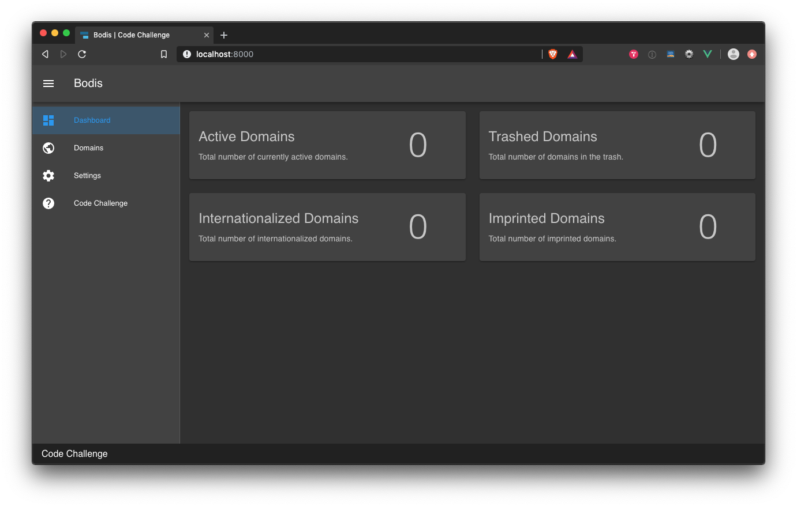

#Code Challenge

We've provided a small Laravel application with an interface built using Vue. Your task is to implement functionality as outlined on the application's *code challenge* page. There are additional bonus items that you may choose to complete as well.



## Prerequisites

1. **php**@*7.1.3+*
2. **node**@*10.6.0+*
3. **npm**@*6.9.0+*
4. **mysql**@*5.5.7+*

## Setup Environment
Install Docker

```
cd path/to/code-challenge
docker-compose up -d
```

SSH into docker container
```
docker exec -ti vue-starter sh
```

## Installation

Install the php dependencies using [composer](https://getcomposer.org/):

```
composer install
```

Install the node dependencies using [npm](https://docs.npmjs.com/cli-documentation/):

```
npm install
```

Copy `.env.example` to `.env`:

```
cp .env.example .env
```

Set the following database variables in `.env` file for your development environment:

```
DB_CONNECTION=mysql
DB_HOST=db
DB_PORT=3306
DB_DATABASE=laravel
DB_USERNAME=root
DB_PASSWORD=123456
```

Run the database migrations using [artisan](https://laravel.com/docs/5.8/artisan):

```
php artisan migrate
```

Start hot reloading for the application's interface:

```
npm run hot
```

Load the application URL in your browser:

```
http://localhost:8008
```

## Get Started

Once the application is loaded please visit the *code challange* page for the requirements. Searching the project source files for the phrase **"Code Challange"** will yield results relevant to each task excluding the bonus items.

## How to Return

Exclude the following directories:

* `/vendor`
* `/node_modules`

## Documentation Resources

The following are links to documentation websites relevant to the code challange:

* [Laravel](https://laravel.com/docs/5.8)
* [Vue](https://vuejs.org/v2/guide/)
* [Vue Router](https://router.vuejs.org)
* [Vuex](https://vuex.vuejs.org/guide/)
* [Vuetify](https://vuetifyjs.com/en/getting-started/quick-start)
* [Axios](https://github.com/axios/axios)


